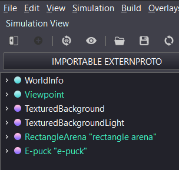
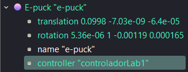
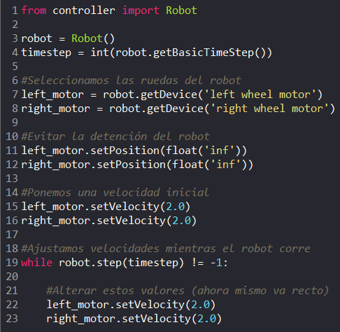
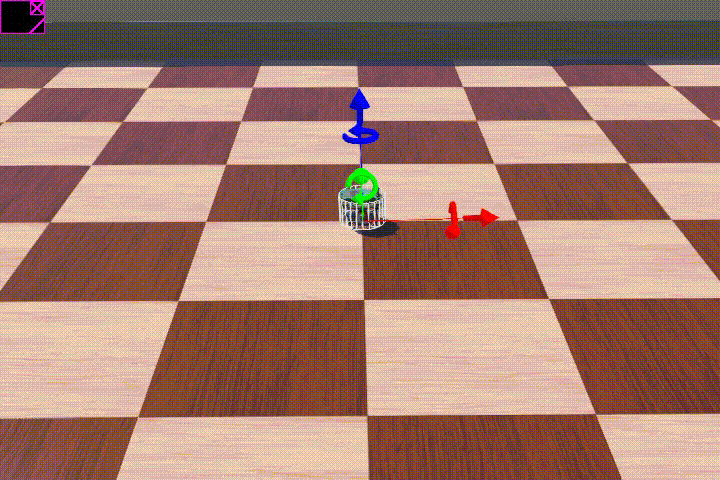
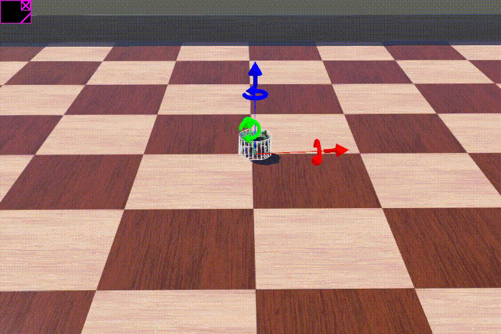
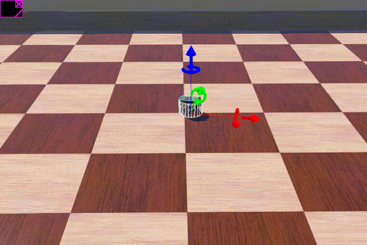
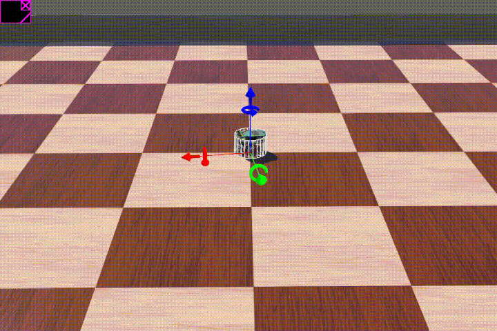
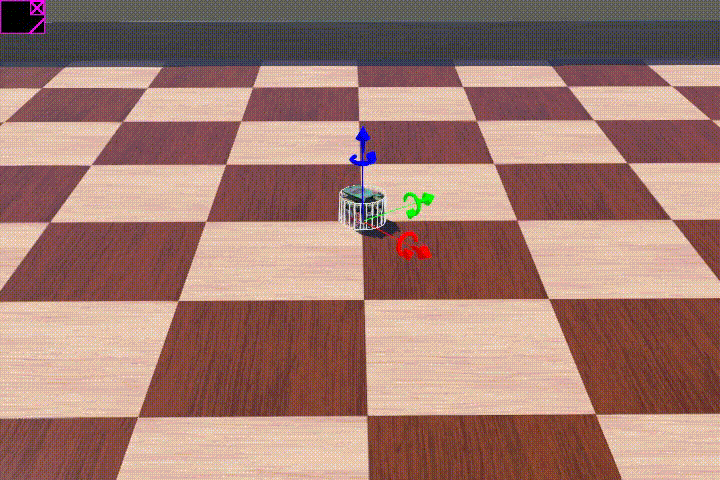

# Laboratorio 1 - Robótica

## Integrantes
* **Diego Álvarez** (Analista)
* **Javier Bórquez** (Integrador)
* **Ariel Carrasco Suárez** (Documentador)
* **Benjamin Peredo** (Experimentador)
* **Diego Valenzuela** (Programador)

---

## Descripción del laboratorio
Este laboratorio consiste en la simulación de un robot móvil diferencial utilizando **Webots**. Un robot móvil diferencial utiliza dos ruedas motrices independientes a cada lado, y su movimiento depende de la velocidad de cada una.

### Especificaciones Técnicas
* **Robot utilizado:** e-puck.
* **Motores:** `left_motor` (izquierdo) y `right_motor` (derecho).
* **Lenguaje:** Python.
* **Controlador:** Permite definir velocidades iniciales, alterar el movimiento y evitar detenciones no deseadas.

---

## Instrucciones de Ejecución

1. **Obtener el código:** Abrir el link de GitHub y clonar el repositorio o descargar las carpetas.
2. **Cargar en Webots:** Abrir el proyecto y seleccionar la opción **E-puck "e-puck"** en el panel izquierdo.

3. **Configurar el controlador:** Asegurarse de que el robot tenga asignado el controlador `controladorLab1`.

4. **Modificar parámetros:** El código Python se visualiza a la derecha. Las **líneas 22 y 23** se utilizan para ajustar las velocidades de los motores y probar distintos comportamientos.

---

## Resultados obtenidos

Antes de explicar las pruebas, se destaca que la velocidad base de ambos motores es 2.0 para avanzar en línea recta. El límite de velocidad es de 6.28; superar este valor arrojará una advertencia en la consola.

Se realizaron 3 pruebas, las cuales consistían en ir alterando la velocidad de los motores (ya sea el de la izquierda o derecha), para ver el comportamiento del robot.

### Prueba 1: left_motor = right_motor
Cuando ambos motores están ajustados a la misma velocidad, el robot avanza en línea recta hasta toparse con la pared y chocar.

### Prueba 2: left_motor != right_motor
Cuando uno de los motores tiene una velocidad distinta al otro, la trayectoria del robot cambia, haciendo giros en círculos.
* Cuando la velocidad de `left_motor` es menor a la de `right_motor`, el robot gira en círculos hacia la izquierda.

* Cuando la velocidad de `left_motor` es mayor a la de `right_motor`, el robot gira en círculos hacia la derecha.

### Prueba 3: right_motor = -left_motor
Cuando a uno de los motores se le atribuye una velocidad negativa, el robot comienza a girar sobre sí mismo en círculos, pero se queda en su lugar.

Al igual que la prueba anterior, dependiendo de a cual motor se le aplique el valor negativo es hacia donde gira:
- Cuando left_motor es negativo (por ejemplo -2.0), el robot gira sobre sí mismo hacia la izquierda.

- Cuando right_motor es negativo, el robot gira sobre sí mismo hacia la derecha.

### Importante: 
- Como se mencionó anteriormente, el límite de velocidad es de 6.28. Si se llega a superar este valor, la consola arrojará una advertencia, indicando que el límite de velocidad es el valor previamente dicho.
- Como es natural, mientras más alta es la velocidad del motor, más rápido hará su trayectoria. Esto podría afectar como se ve la trayectoria del robot, siendo menos fluida. Es por eso que se recomienda poner valores no tan “extremos”.

---

## Preguntas de Análisis

1. **¿Qué ocurre cuando ambas ruedas tienen la misma velocidad?**
   * El robot experimenta un movimiento lineal uniforme, es decir, avanza en línea recta.

2. **¿Cómo cambia la trayectoria cuando las velocidades son diferentes?**
   * El robot siempre pivotará (girará) hacia el lado de la rueda que se mueve más lento.

3. **¿Qué ocurre cuando una rueda gira en sentido opuesto a la otra?**
   * El robot gira sobre su propio eje central.

4. **¿Qué tipo de movimiento permite dibujar un círculo?**
   * Se requiere mantener velocidades constantes en ambas ruedas, pero con valores asimétricos entre ellas.
